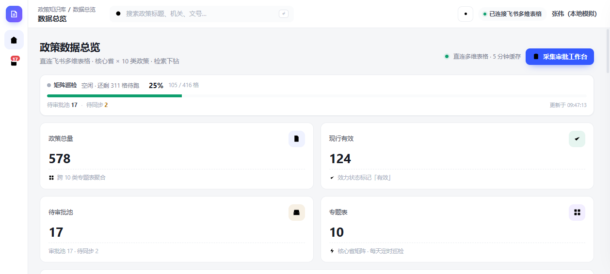
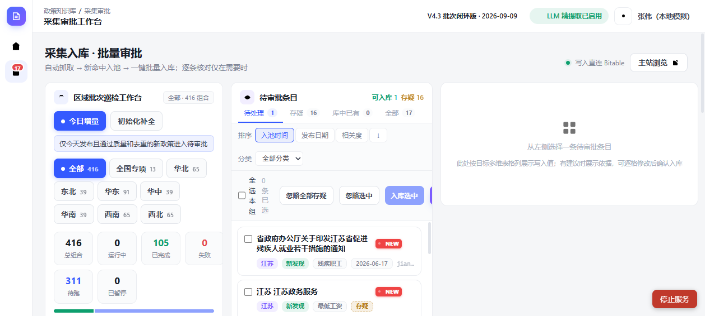

# 政策知识库 · 使用手册

> 本地自托管版 · MOCK_LOGIN 调试模式 · Port 4201

---

## 一、系统概述

### 1.1 是什么

**政策知识库**是一个本地运行的政策法规数据采集与审批平台，核心能力：

| 能力 | 说明 |
|------|------|
| 多维表格浏览 | 直连飞书 Bitable，5 分钟缓存，浏览 578 条政策数据 |
| 爬虫巡检 | 32 省 × 10 类政策关键词，自动抓取新政策入池 |
| 待审批工作台 | 入池后人工审核 → 入库 |
| AI 预审 | 本地规则引擎置信度打分，筛选高质量条目 |

### 1.2 技术栈

```
后端：Node.js + Express（policy-api/src/server.js）
前端：原生 HTML/CSS/JS（无框架）
数据存储：
  - 策略库：飞书 Bitable 多维表格（只读）
  - 爬取结果：本地 JSON（data/db.json）
认证：飞书 OAuth（生产） / MOCK_LOGIN（本地调试）
```

### 1.3 应用边界

```
┌─────────────────────────────────────────────────────────────┐
│                     政策知识库应用                           │
├─────────────────────────────────────────────────────────────┤
│                                                             │
│  【浏览区】                                                   │
│  ┌─────────────────────────────────────────────────────┐   │
│  │  主站首页 (/)：数据总览、政策列表、搜索、分类筛选         │   │
│  │  无需登录即可浏览所有已入库政策                         │   │
│  └─────────────────────────────────────────────────────┘   │
│                                                             │
│  【管理区】（需登录）                                         │
│  ┌─────────────────────────────────────────────────────┐   │
│  │  审批工作台 (/admin/)：矩阵巡检、待审批列表、批量入库    │   │
│  │  采集进度监控、任务状态管理                             │   │
│  └─────────────────────────────────────────────────────┘   │
│                                                             │
│  【数据源】                                                   │
│  ├── 飞书多维表格：已有政策库（578 条，10 类专题表）           │
│  └── 网络爬虫：32 省 × 10 类政策关键词，自动发现新政策         │
│                                                             │
│  【不包含】                                                   │
│  ❌ 非政策类数据（商业新闻、企业内部文档等）                    │
│  ❌ 历史政策归档（仅关注现行有效政策）                          │
│  ❌ 政府内部机密文件                                          │
│                                                             │
└─────────────────────────────────────────────────────────────┘
```

---

## 二、快速启动

### 2.1 前置条件

```bash
# 环境要求
Node.js >= 18
Python（可选，用于数据验证脚本）
```

### 2.2 启动服务

```bash
# 方式一：批处理脚本（推荐）
start_policy_service.bat

# 方式二：手动启动
cd feishu-webapp
set MOCK_LOGIN=true
set PORT=4201
set NODE_ENV=development
node policy-api/src/server.js
```

### 2.3 访问地址

| 页面 | URL | 说明 |
|------|-----|------|
| 主站首页 | http://localhost:4201/ | 政策浏览、数据总览 |
| 审批工作台 | http://localhost:4201/admin/ | 巡检、待审批、批量入库 |
| 健康检查 | http://localhost:4201/healthz | 服务状态 |

---

## 三、核心功能说明

### 3.1 数据总览页（/）

**功能**：
- 政策总量、现行有效数量统计
- 分类分布、地区分布图表
- 关键词搜索、分类/地区/效力筛选
- 待审批池入口（显示未处理条目数）

**操作**：
- 点击分类按钮快速筛选（最低工资 / 平均工资 / 公积金...）
- 点击「待审批池」跳转审批工作台
- 点击「采集审批工作台」进入管理区

> **界面截图**：

### 3.2 审批工作台（/admin/）

**三大核心模块**：

#### ① 矩阵巡检工作台
```
区域批次：全国专项 | 华北 | 东北 | 华东 | 华中 | 华南 | 西南 | 西北
任务状态：全部 416 | 已完成 105 | 待处理 311
进度指标：发现 3592 → 日期过滤 39 → 质量过滤 3400 → 去重 144 → 入池 9
```

**模式切换**：
- **今日增量**：仅抓取今天发布的政策
- **初始化补全**：扫描所有历史记录

**操作按钮**：
- 暂停/恢复巡检
- 优先 +10：提升某个地区优先级
- 手动触发单次巡检

#### ② 待审批列表
```
排序：按入池时间（NEW 徽标显示当天入池条目）
筛选：按地区、类别、质量标签（pass/suspect/unknown）
操作：确认入库 / 忽略 / 查看详情
```

**业务规则**：
- 爬虫入池条目**自动**出现在待审批列表
- 今日入池条目显示红色 **NEW** 徽标
- 双口径区分：`todayAdded`（按发布日期） vs `addedToday`（按入池日期）

#### ③ 巡检状态面板
```
队列：17 条待处理，todayAdded: 0
完成：105 / 416，剩余：311
来源健康度：上海(部分降级) / 江苏(健康) / 山东(SSL错误)
```

> **界面截图**：

---

## 四、十类政策专题

| 类别 | 关键词 | 数据来源 |
|------|--------|----------|
| 最低工资 | 最低工资标准 | 省级人社厅/政府官网 |
| 平均工资 | 平均工资 标准 | 统计局/人社局 |
| 公积金 | 公积金 缴存基数 | 公积金管理中心 |
| 年金 | 企业年金 免税 | 人社部/税务局 |
| 大病医疗 | 大病医疗 个税 扣除 | 税务局/医保局 |
| 高温津贴 | 高温津贴 标准 | 人社厅/应急管理厅 |
| 残疾职工 | 残疾人就业 减免 | 残联/税务局 |
| 婚育相关 | 产假 育儿假 天数 | 卫健委/人社厅 |
| 病假工资 | 病假工资 标准 | 人社局 |
| 薪酬月刊 | 薪酬数据月报 | 统计局 |

---

## 五、API 接口清单

### 5.1 公开接口（无需登录）

| 方法 | 路径 | 说明 |
|------|------|------|
| GET | `/api/me` | 认证状态（返回 mock:true 表示可自动登录） |
| GET | `/api/health` | 健康检查 |
| GET | `/api/crawl/stats` | 爬虫统计 |
| GET | `/api/policies` | 政策列表（公开浏览） |
| GET | `/api/dashboard/stats` | 首页统计 |

### 5.2 需登录接口

| 方法 | 路径 | 说明 |
|------|------|------|
| GET | `/api/crawl/crawled-pending` | 待审批列表 |
| GET | `/api/crawl/matrix-status` | 巡检矩阵状态 |
| POST | `/api/crawl/matrix-run` | 启动巡检 |
| POST | `/api/crawl/confirm` | 确认入库 |
| POST | `/api/crawl/ignore` | 忽略条目 |
| POST | `/api/crawl/ai-extract` | AI 字段提取 |
| POST | `/auth/login` | MOCK 登录（自动写入 session） |

### 5.3 认证机制

```
MOCK_LOGIN=true 模式：
  1. 访问 /auth/login → 服务端写入 fsapp_session cookie
  2. 前端检测 mock:true → 自动触发登录
  3. 后续 API 请求携带 cookie → 通过鉴权
```

---

## 六、数据流转说明

```
┌─────────────┐    爬虫抓取    ┌─────────────┐    人工审批    ┌─────────────┐
│  政府官网    │ ───────────→ │  待审批池    │ ───────────→ │  多维表格    │
│  (网络搜索)  │   入池 + NEW  │  (db.json)  │   确认入库    │  (Bitable)  │
└─────────────┘               └─────────────┘              └─────────────┘
                                      ↑
                                      │ 查看/筛选/导出
                                 ┌─────────────┐
                                 │  审批工作台   │
                                 │  (/admin/)   │
                                 └─────────────┘
```

---

## 七、常见问题

### Q1：登录后页面显示空数据？
**原因**：session cookie 过期（服务重启后常见）
**解决**：刷新页面（Ctrl+Shift+R），前端会自动调用 `/auth/login` 重新登录

### Q2：山东/湖北地区巡检返回 SSL 错误？
**原因**：目标网站 SSL 证书配置问题
**解决**：这是服务端问题，不影响其他省份；已记录在 sourceHealth 中

### Q3：如何停止服务？
```bash
taskkill /F /PID 14456   # 或通过任务管理器结束 node.exe
```

### Q4：如何重置数据？
```bash
# 清空爬取结果（保留配置）
rm data/db.json
# 重启服务会自动重建空库
```

---

## 八、目录结构

```
feishu-webapp/
├── .env                          # 环境变量（MOCK_LOGIN=true, PORT=4201）
├── policy-api/
│   ├── src/
│   │   ├── server.js             # 主服务入口
│   │   ├── auth.js               # 认证中间件
│   │   ├── crawl-api.js          # 爬虫 API
│   │   ├── crawler.js            # 爬虫核心逻辑
│   │   ├── db.js                 # 本地数据存储
│   │   └── normalize.js          # 数据标准化
│   └── public/
│       ├── app/                  # 主站前端
│       └── admin/                # 审批台前端
├── docs/
│   ├── screenshots/              # 界面截图
│   └── README-使用手册.md        # 本文档
└── start_policy_service.bat      # 启动脚本
```

---

*最后更新：2026-09-10 | 版本 V4.3 批次闭环版*
